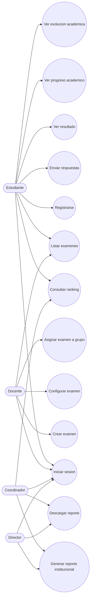
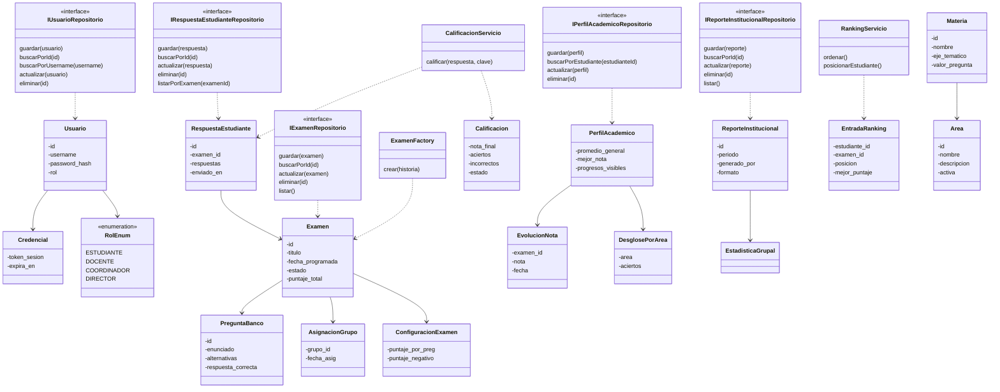
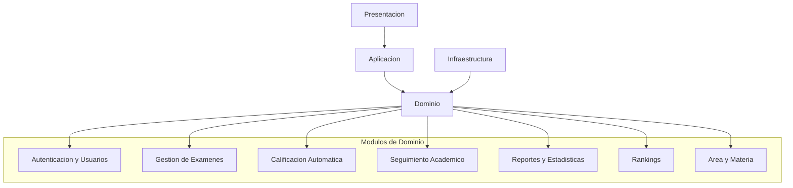

# Sistema Academico

Repositorio del equipo para el sistema academico propuesto en el laboratorio de Arquitectura Guiada por Dominio. La estructura esta organizada siguiendo recomendaciones de DDD: separacion por capas, modulos de dominio, servicios de aplicacion e infraestructura.

## Proposito

El proposito del sistema es apoyar la gestion academica de evaluaciones, permitiendo registrar usuarios, crear examenes, asignarlos a grupos, recibir respuestas de estudiantes, calificar automaticamente, consultar el seguimiento academico y generar reportes institucionales.

El proyecto busca mantener el nucleo del negocio dentro de la capa de dominio, evitando que las reglas academicas dependan directamente de controladores, base de datos o tecnologia externa.

## Estructura del Repositorio

```txt
sistema-academico/
├── docs/
│   └── uml/
│       └── ISUML.mdj
├── src/
│   ├── presentacion/
│   ├── aplicacion/
│   ├── dominio/
│   │   ├── autenticacion_usuarios/
│   │   ├── gestion_examenes/
│   │   ├── calificacion_automatica/
│   │   ├── seguimiento_academico/
│   │   ├── reportes_estadisticas/
│   │   ├── rankings/
│   │   └── area_materia/
│   └── infraestructura/
└── tests/
```

## Funcionalidades

### Funcionalidades de Alto Nivel

El sistema contempla las siguientes funcionalidades principales:

- Gestionar usuarios y autenticacion.
- Crear, configurar, asignar y listar examenes.
- Enviar respuestas de estudiantes.
- Calificar respuestas automaticamente.
- Consultar progreso y evolucion academica.
- Generar y descargar reportes institucionales.
- Consultar rankings academicos.

### Diagrama de Casos de Uso UML



### Prototipo o GUI

El prototipo puede organizarse alrededor de estas pantallas:

- Pantalla de inicio de sesion y registro.
- Panel del docente para crear, configurar y asignar examenes.
- Panel del estudiante para listar examenes, responder y ver resultados.
- Panel de seguimiento academico para consultar progreso y evolucion.
- Panel institucional para generar reportes y visualizar estadisticas.
- Vista de ranking por examen o periodo academico.

## Modelo de Dominio

### Modulos del Dominio

El dominio esta dividido en los siguientes modulos:

- `autenticacion_usuarios`: usuarios, credenciales y roles.
- `gestion_examenes`: examenes, preguntas, configuracion y asignacion.
- `calificacion_automatica`: respuestas, calificaciones y servicio de calificacion.
- `seguimiento_academico`: perfil academico, evolucion de notas y desglose por area.
- `reportes_estadisticas`: reportes institucionales y estadisticas grupales.
- `rankings`: entradas de ranking y servicio de ordenamiento.
- `area_materia`: areas y materias academicas.

### Diagrama de Clases del Dominio



## Vista General de Arquitectura

La arquitectura sigue una organizacion por capas:

- `presentacion`: recibe peticiones desde la interfaz o API y llama a los servicios de aplicacion.
- `aplicacion`: coordina casos de uso y orquesta operaciones del dominio.
- `dominio`: contiene reglas de negocio, entidades, value objects, servicios de dominio, factories e interfaces de repositorio.
- `infraestructura`: contiene implementaciones concretas de persistencia y servicios externos.

### Diagrama de Paquetes



### Diagrama de Clases por Capas

```mermaid
classDiagram
    class UsuarioController {
      iniciarSesion()
      registrarUsuario()
      listarUsuarios()
    }

    class ExamenController {
      crearExamen()
      configurarExamen()
      asignarGrupo()
      listarExamenes()
    }

    class RespuestaEstudianteController {
      enviarRespuestas()
      verResultado()
    }

    class PerfilAcademicoController {
      verProgreso()
      verEvolucion()
    }

    class ReporteInstitucionalController {
      generarReporte()
      descargarReporte()
    }

    class UsuarioAppService {
      iniciarSesion()
      registrarUsuario()
      obtenerUsuario()
    }

    class ExamenAppService {
      crearExamen()
      configurarExamen()
      asignarGrupo()
      listarExamenes()
    }

    class RespuestaEstudianteAppService {
      registrarRespuestas()
      calificarRespuesta()
      obtenerCalificacion()
    }

    class PerfilAcademicoAppService {
      obtenerProgreso()
      obtenerEvolucion()
      obtenerDesglosePorArea()
    }

    class ReporteInstitucionalAppService {
      generarReporte()
      exportarPDF()
    }

    class UsuarioRepositorioImpl
    class ExamenRepositorioImpl
    class RespuestaEstudianteRepositorioImpl
    class PerfilAcademicoRepositorioImpl
    class ReporteInstitucionalRepositorioImpl

    class IUsuarioRepositorio
    class IExamenRepositorio
    class IRespuestaEstudianteRepositorio
    class IPerfilAcademicoRepositorio
    class IReporteInstitucionalRepositorio

    UsuarioController --> UsuarioAppService
    ExamenController --> ExamenAppService
    RespuestaEstudianteController --> RespuestaEstudianteAppService
    PerfilAcademicoController --> PerfilAcademicoAppService
    ReporteInstitucionalController --> ReporteInstitucionalAppService

    UsuarioAppService --> IUsuarioRepositorio
    ExamenAppService --> IExamenRepositorio
    RespuestaEstudianteAppService --> IRespuestaEstudianteRepositorio
    PerfilAcademicoAppService --> IPerfilAcademicoRepositorio
    ReporteInstitucionalAppService --> IReporteInstitucionalRepositorio

    UsuarioRepositorioImpl ..|> IUsuarioRepositorio
    ExamenRepositorioImpl ..|> IExamenRepositorio
    RespuestaEstudianteRepositorioImpl ..|> IRespuestaEstudianteRepositorio
    PerfilAcademicoRepositorioImpl ..|> IPerfilAcademicoRepositorio
    ReporteInstitucionalRepositorioImpl ..|> IReporteInstitucionalRepositorio
```



## Tecnologia

La estructura actual esta preparada para adaptarse al lenguaje y framework elegidos por el equipo. Al definir la tecnologia, los archivos `.txt` pueden reemplazarse por la extension correspondiente, por ejemplo:

- Java con Spring Boot: `.java`
- C# con ASP.NET Core: `.cs`
- TypeScript con NestJS: `.ts`
- Python con FastAPI: `.py`

## Estado del Proyecto

- Estructura inicial creada.
- Diagrama UML incluido en `docs/uml/ISUML.mdj`.
- Modulos organizados siguiendo DDD.
- Pendiente: implementar clases, controladores, persistencia, pruebas y prototipo visual.
